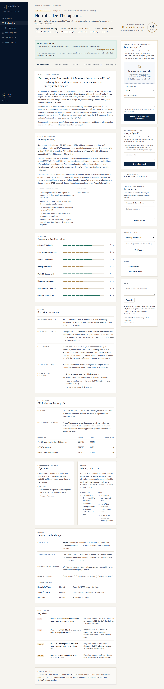
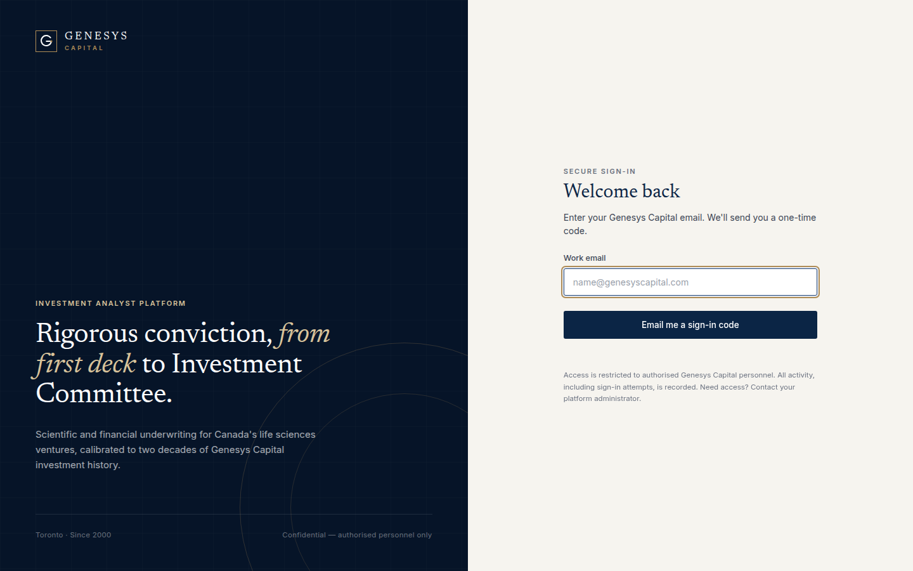
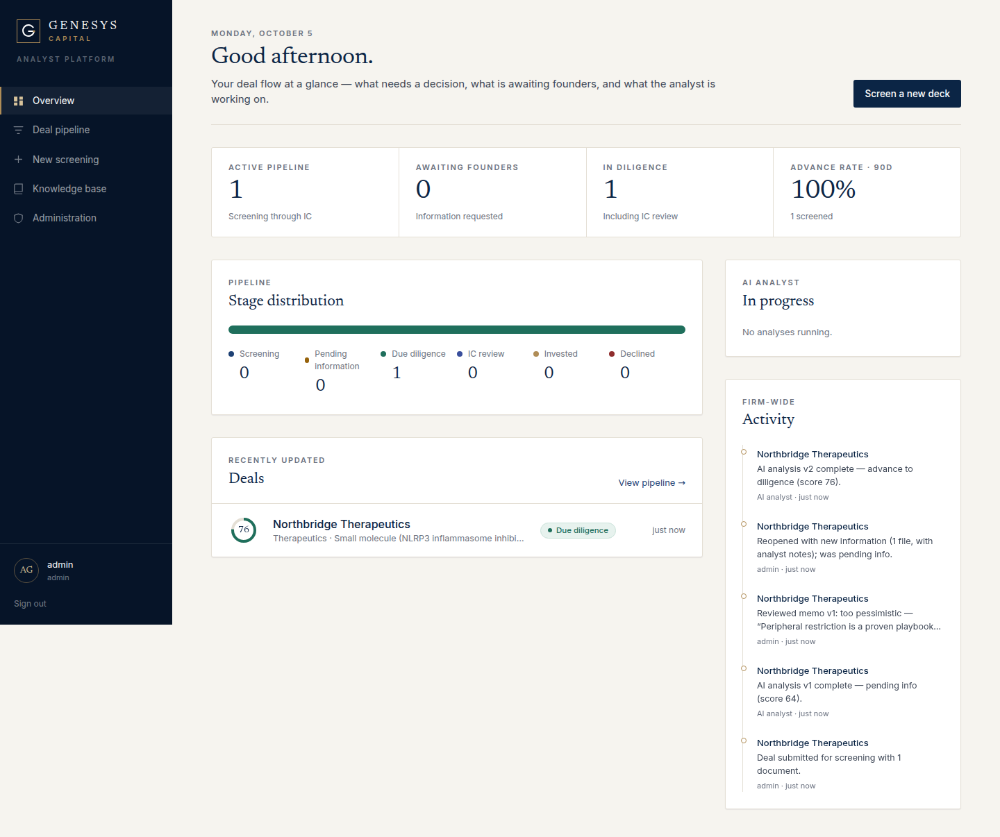
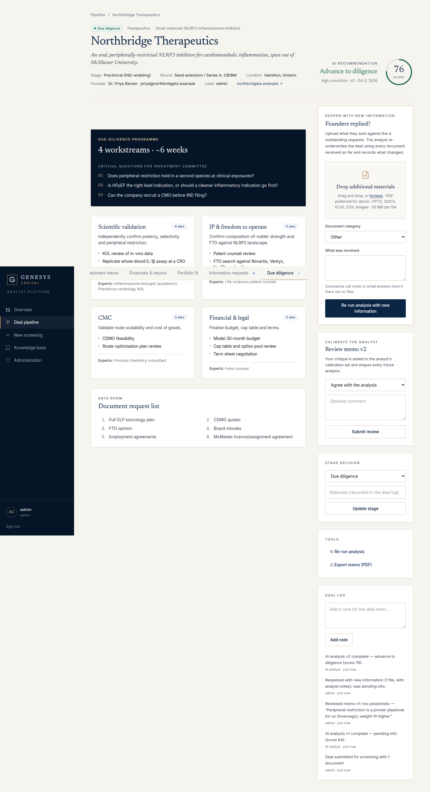
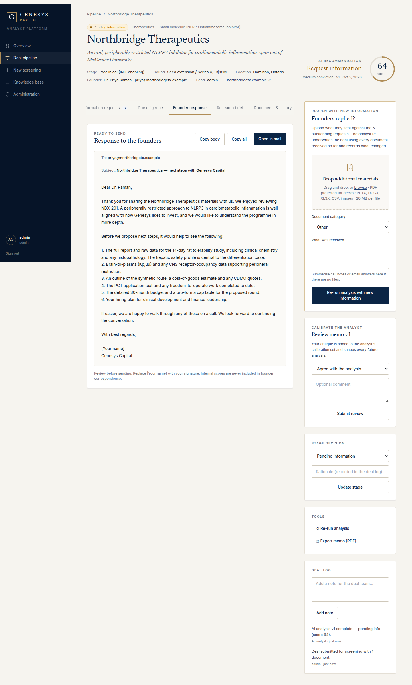
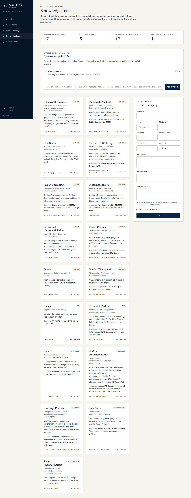
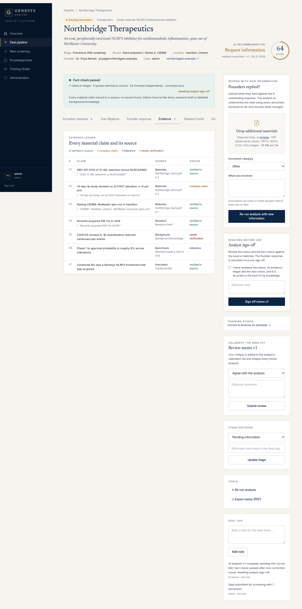
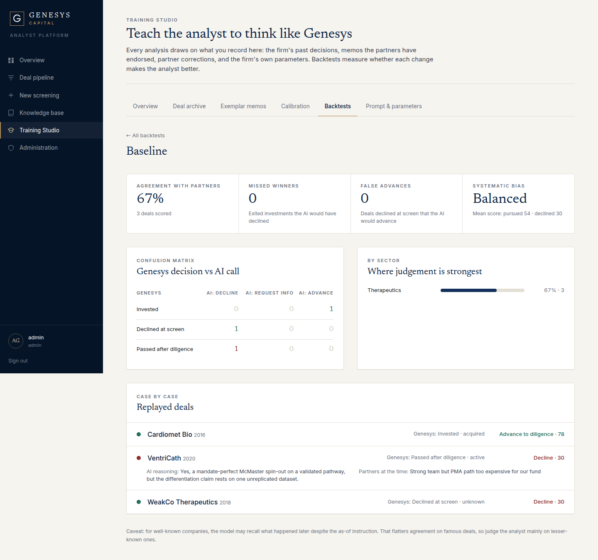
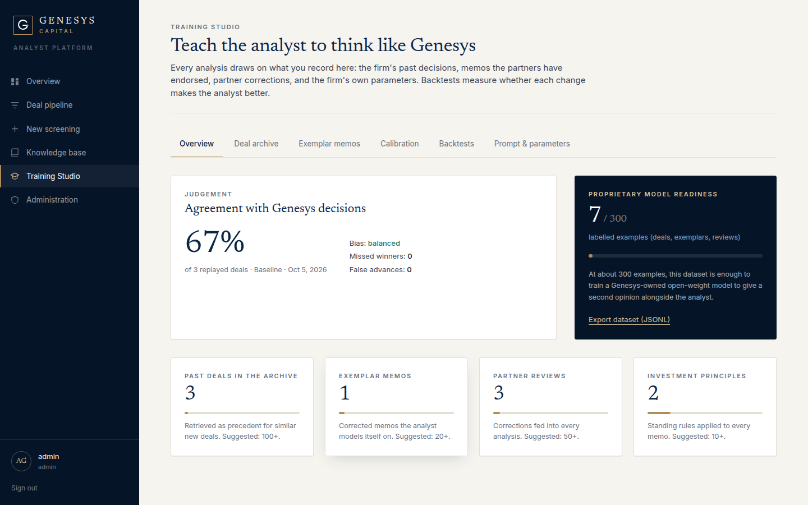

# Genesys Analyst

**The AI investment-analyst platform for Genesys Capital, Toronto.**

Upload a pitch deck. The AI analyst reads every slide, researches the science, competitors and comparable deals, benchmarks the opportunity against Genesys' own investment history, and returns a full IC-style memo with one of three decisions:

| Decision | Deal stage | What you get |
|---|---|---|
| **Decline** | Declined | Rationale and a courteous decline email |
| **Request information** | Pending information | Prioritised information requests and an email listing exactly what the founders must send |
| **Advance to diligence** | Due diligence | A full diligence programme (workstreams, experts, IC questions, data-room request list) and a next-steps email |

When founders reply, **reopen the deal**: upload their materials and the analyst re-underwrites it using everything received so far. Each analysis is versioned and records what changed.



## Features
- **Passwordless sign-in.**
  - A one-time 6-digit code is emailed to the user. Codes expire after 10 minutes, are single-use and are hashed at rest.
  - Brute-force protection: 5 attempts per code, 5 codes per 15 minutes.
  - **Allow-list only:** a user must be added by an administrator, and only `@genesyscapital.com` addresses can be added.
  - Sessions last 12 hours and can be revoked server-side.
- **Deck screening.**
  - Formats: PDF (read visually), PPTX (including speaker notes), DOCX, XLSX (including formulas), CSV, TXT and images.
- **The memo covers:**
  - "Is this worth our time?" verdict and executive summary.
  - 8-dimension scorecard with evidence.
  - Science (data-quality critique, de-risking experiments).
  - Clinical & regulatory path with milestones.
  - IP, market and competitors, team.
  - Financials, with Bear/Base/Bull returns and probability-weighted MOIC.
  - Portfolio fit, with comparable Genesys investments.
  - Risk register and analyst caveats.
- **Founder response:** a copy-paste email (or "Open in mail") tailored to the decision.
- **Deal pipeline:** stages are Screening → Pending information → Due diligence → IC review → Invested / Declined. The pipeline also has search, a deal log, notes, a document room by round, a version history, and a print/PDF export.
- **Knowledge base:**
  - The Genesys portfolio with outcomes and lessons (seeded from public sources).
  - The partnership's **investment principles**, applied to every analysis.
- **Hallucination controls:**
  - Every material claim is recorded in an evidence ledger with its source and an exact quote.
  - Quotes, URLs and cited companies are checked in code.
  - An independent fact-checker reviews every memo, with automatic correction.
  - An analyst must sign off before the founder email is unlocked.
- **House writing standard:** no em dashes, no AI-sounding phrasing; memos and emails read like the work of an experienced investment professional.
- **Training Studio:**
  - Deal archive with bulk CSV import, retrieved as precedent.
  - Exemplar memos endorsed by partners.
  - Calibration analytics, with suggested principles.
  - Backtests against Genesys' real decisions.
  - Editable firm parameters, the full prompt visible in-app, and a dataset export for a future proprietary model.
- **Analyst calibration:** partners review each memo (agree / too optimistic / too pessimistic / wrong decision), and that feedback shapes every future analysis.

See [docs/AI_ANALYST_DESIGN.md](docs/AI_ANALYST_DESIGN.md) for how all of this works.
- **Roles:**
  - Analyst.
  - Partner: can move deals to IC review or Invested, and curates the knowledge base.
  - Admin: manages users.
- **Audit log:** covers sign-ins, failed attempts, document downloads, stage changes and access changes.

## Architecture
| Layer | Technology |
|---|---|
| App | Next.js 16 (App Router, server actions), React 19, TypeScript, Tailwind CSS v4 |
| Data | PostgreSQL via Prisma. Documents are stored in the database; there is no third-party file storage. |
| AI | Anthropic Claude Opus 5.5: native PDF/vision, adaptive thinking, structured outputs, server-side web search, server-side refusal fallback |
| Email | Any SMTP provider (Microsoft 365, SES, SendGrid) |

Code map:
- `src/lib/ai/`: prompts, memo schema, document extraction, analysis pipeline.
- `src/lib/auth/`: one-time-code authentication and sessions.
- `src/lib/deals/`, `src/lib/admin/`: server actions.
- `src/app/(app)/`: authenticated screens.
- `prisma/`: schema, migrations, seed.

## Getting started
```bash
cp .env.example .env            # fill in DATABASE_URL, AUTH_SECRET, SMTP_*, ANTHROPIC_API_KEY, SEED_ADMIN_EMAILS
npm install
npx prisma migrate deploy
npm run db:seed                 # creates admin user(s) + portfolio knowledge base
npm run dev                     # http://localhost:3000
```
Without SMTP, development mode prints sign-in codes to the server console.

Docker alternative: `docker compose up --build`.

### Adding Genesys users
Choose one:
- Set `SEED_ADMIN_EMAILS` / `SEED_ANALYST_EMAILS` and run `npm run db:seed`.
- An admin adds users under **Administration → Authorise users**.

## Deploying on Render
1. In Render: **New → Blueprint**, select this repository. `render.yaml` creates the web service and a Postgres database.
2. When prompted, enter `ANTHROPIC_API_KEY`, `SEED_ADMIN_EMAILS` (your email) and `APP_URL` (the Render URL). Leave SMTP blank for now.
3. Deploy. Migrations and seeding run automatically on every start.
4. **Testing mode:** `ENABLE_ADMIN_BYPASS=true` shows a "Continue as administrator" button on the sign-in page, and a red banner reminds everyone it is on.
   - Set `ADMIN_BYPASS_UNTIL` (YYYY-MM-DD) so it switches itself off.
   - Set the flag to `false` before uploading confidential decks.
   - Until SMTP is configured, sign-in codes appear in the Render logs.

## Production checklist
1. **Hosting.** Use Canadian data residency, for example Azure Canada Central or AWS ca-central-1, with managed Postgres (encrypted, with point-in-time recovery).
2. **AUTH_SECRET.** At least 32 random characters.
3. **SMTP.** Configure it, with SPF/DKIM on the sending domain.
4. **Anthropic API key.** Use an organisation account under commercial terms. Optionally request zero data retention.
5. **Branding.** Apply official brand assets (see [docs/FIRM_RESEARCH.md](docs/FIRM_RESEARCH.md#branding)).
6. **Knowledge base.** Partners verify the seeded portfolio records, then add lessons learned and investment principles.
7. **Long-running work.** Analyses run in-process after the request returns, which suits a single always-on server. For horizontal scaling, move `runAnalysis` onto a job queue.

## Screens
| | |
|---|---|
|  |  |
|  |  |
|  |  |
|  |  |
|  | |

The example company in the screenshots ("Northbridge Therapeutics") is fictitious test data.

---
Confidential. Built for Genesys Capital.
